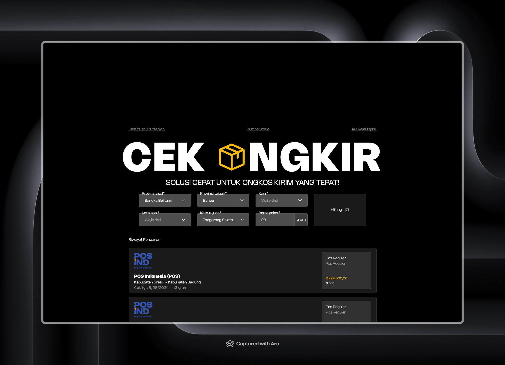

<br/>

# Cek Ongkir dengan API RajaOngkir


### Framework, library, language or API used in this site

- [Next.js - Framework / Bootstrap](https://nextjs.org)

- [TailwindCSS - Styling library](https://tailwindcss.com)

- [React Query - API manager library](https://tanstack.com/query/latest)

- [Jotai - State manager library](https://jotai.org/)

- [Framer Motion - Animation library](https://www.framer.com/motion)

- [HeadlessUI - UI unstyled component library](https://headlessui.com/)

<br/>

### Project highlights

1. Built upon Next.js 14 App Router, using latest React technology React Server Component

2. Utilize React Query + Server Actions for prefetch data and API calls, covers API endpoints, improve content first load time, and reduce unnecessary data fetching by caching.

3. Uses framer-motion animation libaray, provide smooth animation upon layout change*

4. Persisted search history by Jotai, saves every search update to local storage and restores on page load.

5. Based on TypeScript, ensures type safety and code quality across the codebase.

6. Responsive design, optimized for mobile devices.

### How to use?

1. Easy, just visit this [live site](https://dotkurir.vercel.app/) or follow section below to run the project locally.

2. Choose province for origin and destination, city selection will be available after you select province.

3. Choose courier of your choice, weight of the package (in gram) and calculate the cost by clicking enter or the big "Hitung" button.

4. After a ms, the available services alongside the costs variety will be displayed below in search history.

5. Upon page leave or refresh, the search history will be saved and available for your next visit.

### How to run locally

1. Clone the repo

    ```bash
    git clone https://github.com/yusrmuttaqien/dotkurir-site.git
    ```

2. Open terminal and navigate to the project directory

    ```bash
    cd dotkurir-site
    ```

3. Install all dependencies

    ```bash
    npm install

    # or

    bun install
    ```

4. Initialize required environment variables `.env` in root directory (one level with `/src` folder)

    ```env
    RAJA_ONGKIR_API_KEY=...
    RAJA_ONGKIR_BASE_URL=...
    ```

    Note:
    - `RAJA_ONGKIR_API_KEY` is your Raja Ongkir API key, retrive it from [your account panel](https://rajaongkir.com/akun/panel)
    - `NEXT_PUBLIC_BASE_URL` is the base URL of [Raja Ongkir's API](https://arc.net/l/quote/mcayiszy). The base URL should matches your account type (starter or pro). [If link before doesn't work](https://rajaongkir.com/dokumentasi)

5. Run the development server

    ```bash
    npm run dev

    # or

    bun run dev
    ```

6. Open [http://localhost:3000](http://localhost:3000) with your browser to see the local website.

## Credits

### <a href="https://github.com/yusrmuttaqien">Yusril Muttaqien</a> - 2024
